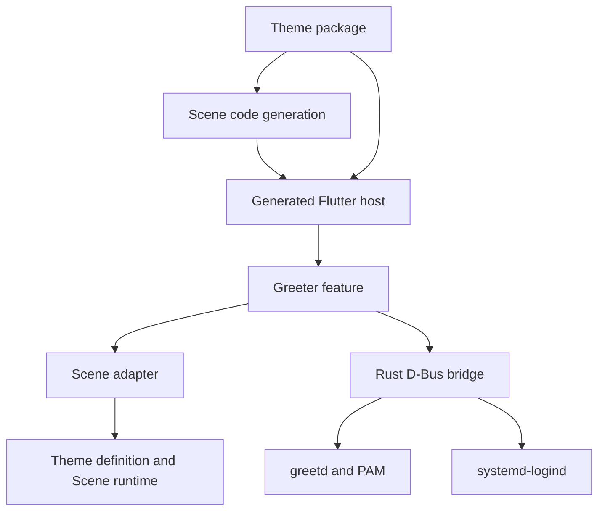

## Build boundary

A theme package owns its scene JSON, visual tokens, assets, and components. The
CLI selects one package, generates scene Dart, and creates an executable host
that imports its builder. Production consumes compiled Dart and bundled assets.

## Frontend boundary

The application owns the greeter feature, credential controller, and selected
theme. The feature owns business state and exposes typed slots and commands.
The scene adapter maps semantic state into predicates and a narrow theme host.
The runtime owns layout, transforms, presence, and animation lifetime.

Themes never communicate with the backend directly. They receive display state
and semantic callbacks. See the [frontend architecture](frontend.md).

## Backend boundary

The Rust bridge owns the greetd socket, PAM conversation, attempt generation,
session validation, and power requests. It exposes the
[D-Bus contract](../reference/dbus.md). The private/session bus carries frontend
calls; system D-Bus is used separately for logind operations.

Start with the [code map](code-map.md) to locate each owner in the repository.
