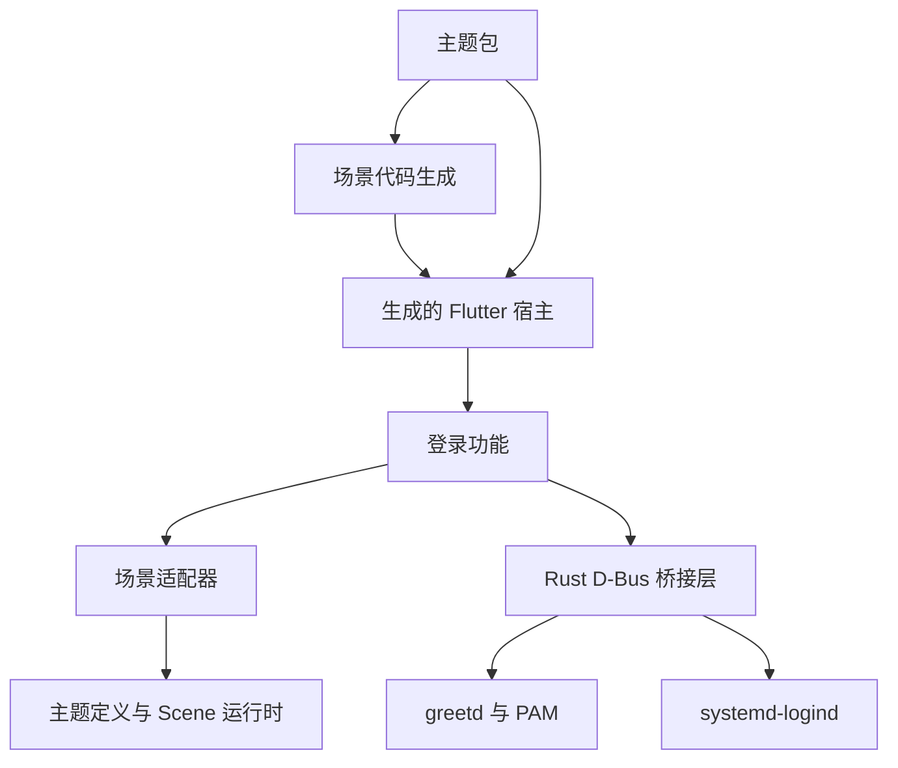

## 主题如何构建

每个主题包包含自己的场景 JSON、样式参数、资源和组件。CLI 根据选定主题生成场景代码，再创建调用该主题 builder 的 Flutter 应用项目。正式应用使用编译好的 Dart 代码和打包资源。

## Flutter 前端负责什么

应用管理登录状态、凭据输入和当前主题。功能层通过带有明确类型的状态接口和命令与主题交互。场景适配器把登录状态转换为场景条件，并向主题提供宿主 API。场景运行时处理布局、变换以及组件进入和退出时的动画。

主题从宿主读取要显示的状态，并通过回调响应用户操作。与后端通信的细节由应用处理。详情见[前端架构](frontend.md)。

## Rust 后端负责什么

Rust 后端连接 greetd，处理 PAM 身份验证、登录尝试标识、桌面会话校验和电源请求。前端通过私有或会话 D-Bus 调用后端；后端另用系统 D-Bus 调用 logind。接口定义见 [D-Bus 接口约定](../reference/dbus.md)。

要找某个功能的实现，可以先看[代码导航](code-map.md)。
