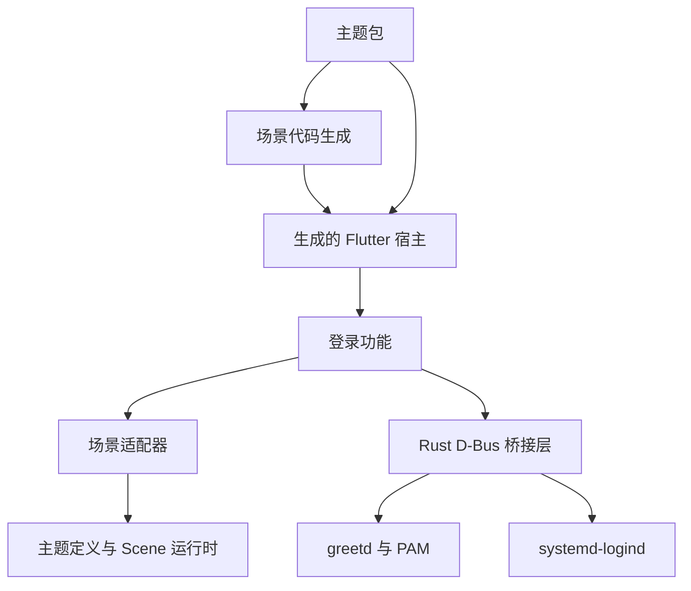

## 构建边界

主题包管理自己的场景 JSON、视觉 token、资源和组件。CLI 选择一个包，生成场景 Dart 代码，并创建导入该主题 builder 的可执行宿主。生产程序使用编译后的 Dart 代码和打包资源。

## 前端边界

应用负责登录功能、凭据控制器和所选主题。功能层管理业务状态，并提供类型化插槽和命令。场景适配器将语义状态映射为谓词和精简的主题宿主 API。运行时管理布局、变换、组件出现过程和动画生命周期。

主题不会直接与后端通信；它们接收显示状态和语义回调。详情见[前端架构](frontend.md)。

## 后端边界

Rust 桥接层负责 greetd socket、PAM 对话、尝试序号、会话校验和电源请求。接口定义见 [D-Bus 约定](../reference/dbus.md)。私有/会话总线承载前端调用；system D-Bus 单独用于 logind 操作。

可从[代码导航](code-map.md)开始查找仓库中的各个职责模块。
