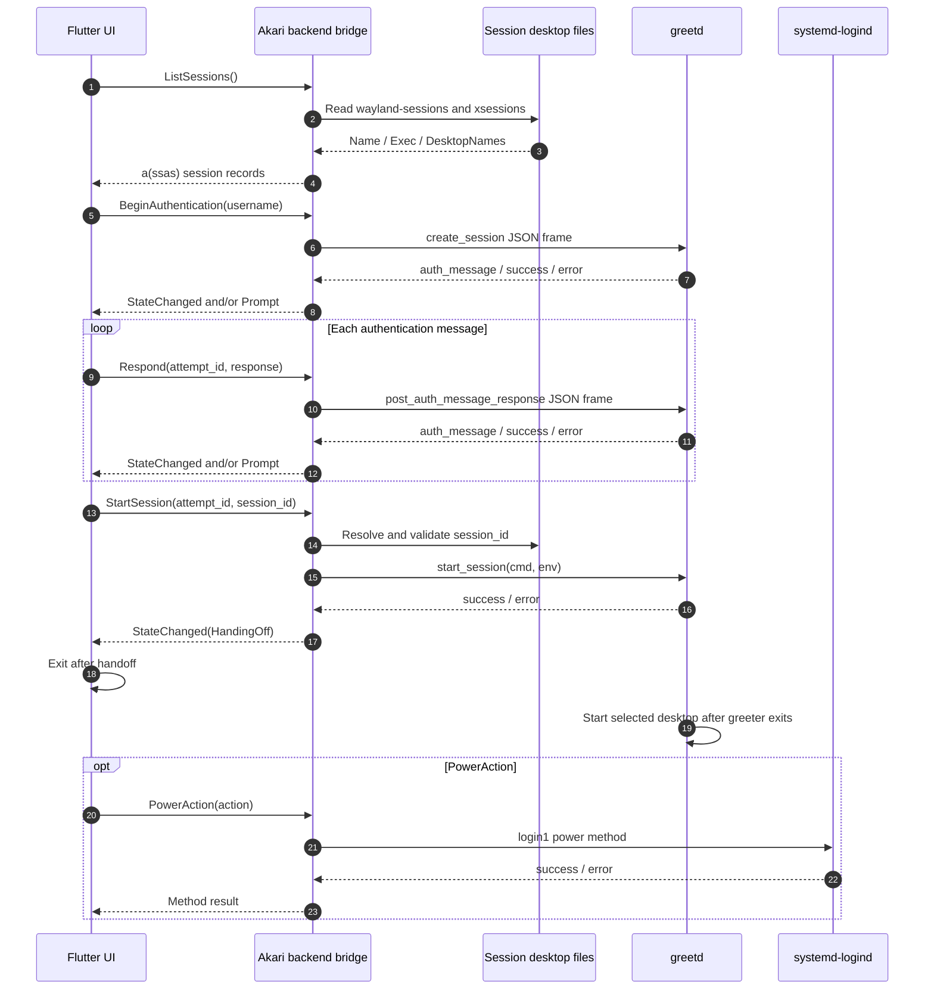
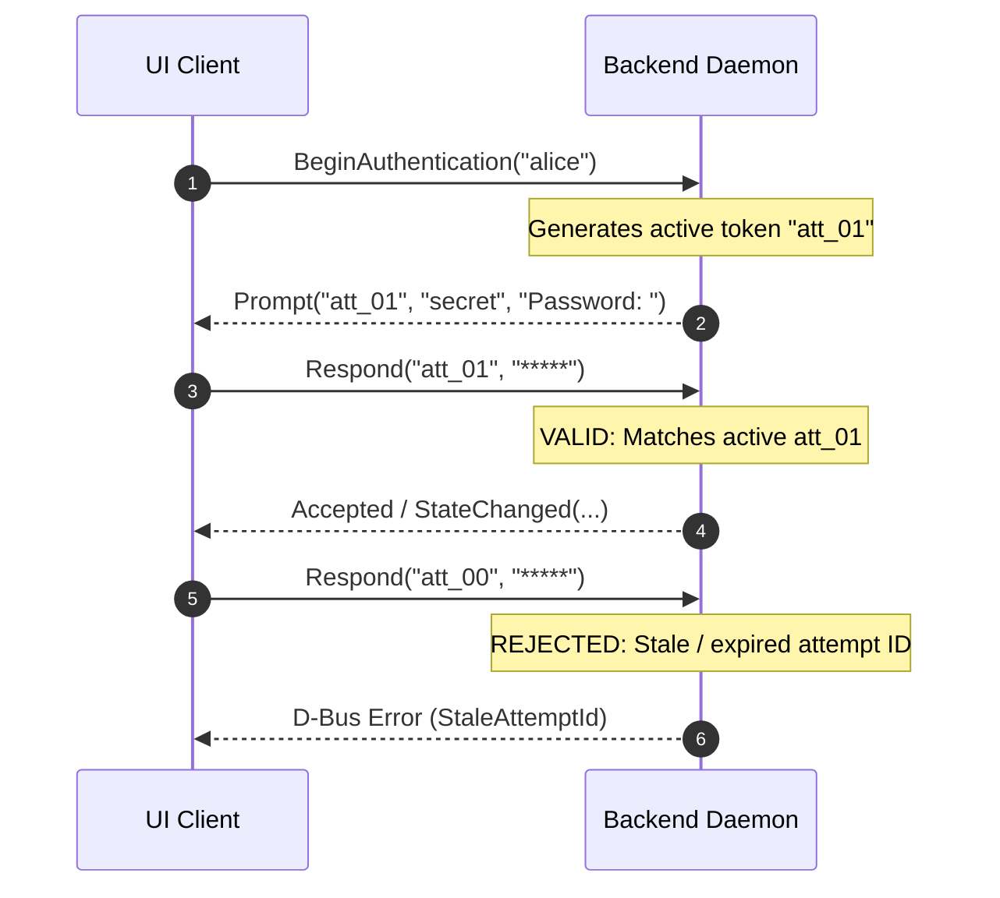
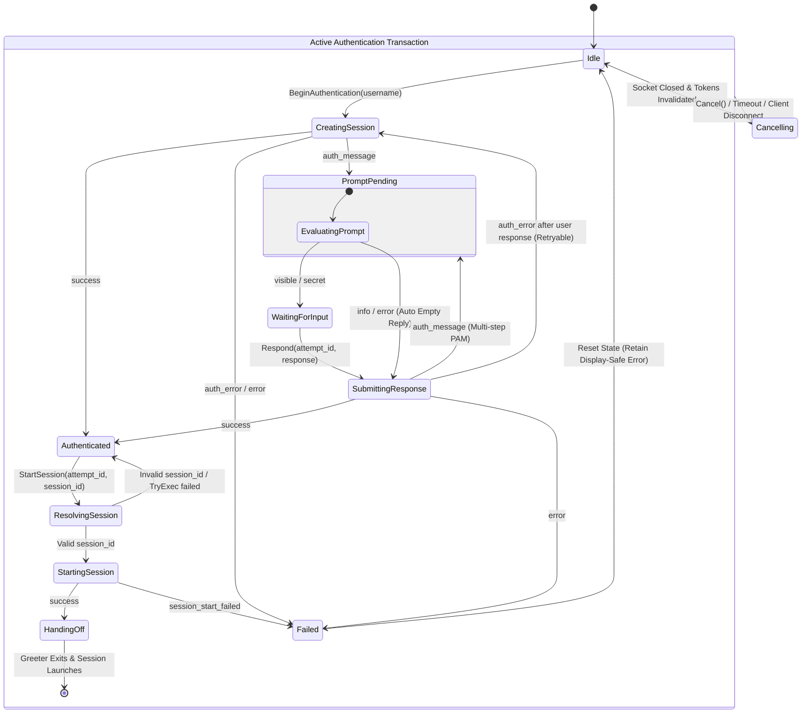

本文说明 Flutter 前端与 Rust 后端如何通过 D-Bus 通信，包括方法、信号、状态转换和安全要求。

## 1. 系统架构与组件分工

系统通过一个专用、无特权的后端桥接层，将 UI（Flutter 客户端）与系统服务（`greetd` 和 `systemd-logind`）解耦。

```text
┌───────────────────────────────────────────────────────────┐
│                    Flutter UI Client                      │
│            (Unprivileged / Non-root User)                 │
└─────────────────────────────┬─────────────────────────────┘
                              │
                              │ Private / Session D-Bus
                              │ Bus: io.akari.Greeter
                              │ Interface: io.akari.Greeter1
                              ▼
┌───────────────────────────────────────────────────────────┐
│              Akari Backend Bridge Daemon                 │
│         (Translates D-Bus Calls to greetd / System)       │
└──────────────┬─────────────────────────────┬──────────────┘
               │                             │
               │ Unix Domain Socket          │ System D-Bus
               │ 32-bit native-endian      │ (org.freedesktop.login1)
               │ length + UTF-8 JSON       │
               ▼                             ▼
┌─────────────────────────────┐   ┌─────────────────────────┐
│           greetd            │   │     systemd-logind      │
│   (PAM Authentication)      │   │   (Power Management)    │
└─────────────────────────────┘   └─────────────────────────┘
```

### 通信流程

上图展示各组件的职责，下面的时序图展示它们如何通信。桌面会话文件由后端直接读取，不是独立的进程通信端点。



对于 `info` 和 `error` 身份验证消息，后端会发出供界面显示的提示，并可自动提交空响应。对于 `visible` 和 `secret` 消息，则必须等待 UI 响应。循环不得假设只有一次密码提示。

接口不限定身份验证方式。系统的 PAM 配置可以使用密码、指纹、人脸服务、智能卡，也可以组合多种方式。Akari 不会根据人脸或指纹识别用户；UI 会为用户选择的用户名启动尝试，由系统身份验证配置决定使用哪种方式。

当前 `Prompt` 信号只表示 greetd/PAM 对话消息：`visible`、`secret`、`info` 和 `error`。UI 不得根据任意提示文本推断生物识别服务。如果未来后端能够取得权威的服务进度，应另外提供类型化、适合界面显示的交互事件，不要改变这些提示类型的含义。原始摄像头帧、指纹数据、生物模板和服务密钥不得进入 D-Bus 约定。

### 为什么这样分工

- **框架隔离**：Flutter 前端不需要了解 Unix domain socket、PAM 消息格式、二进制帧打包方式或 `systemd` D-Bus 接口。
- **可测试性**：可在私有 D-Bus 会话（`dbus-run-session`）中构建并运行独立的模拟后端（`cargo run --features mock`），无需运行真实 `greetd` 守护进程或提升权限即可进行完整 UI 开发和自动化集成测试。生产构建不包含模拟传输，也不会从运行时环境变量中选择它。
- **最小权限**：UI 作为无特权客户端运行，不能直接访问 root 或系统级控制接口。

### 并发模型

身份验证由一个 actor 统一管理。会改变状态的 D-Bus 方法把命令放入队列，等待对应回复。`AuthStateMachine`、当前 `GreetdTransport`、取消句柄和调用方信息只由这个 actor 操作。`GetState()` 直接读取 `watch` 快照，不会阻塞 greetd I/O。

actor 一次只处理一个身份验证命令，因此 greetd 请求和状态转换不会与 `Respond()`、`Cancel()` 或新的 `BeginAuthentication()` 并行。会话目录扫描在 actor 外的阻塞 worker 任务中执行；只有尝试 ID 仍为当前值时，扫描结果才会提交。这样可以丢弃过期扫描结果，无需再为后端、操作、传输或请求入口分别加锁。

后端进程负责启动和监控 actor 任务。收到 SIGINT、SIGTERM，或登录界面的 D-Bus 连接断开时，会关闭服务、中断待处理的 greetd I/O，并等待身份验证在限定时间内清理完成。actor 失败会关闭服务并以错误退出；停止的 actor 会拒绝状态查询，而不是返回旧快照。actor 和断开监视器持有弱命令发送端；释放所有外部句柄也会触发清理。

成功的 `StartSession` 回复会使用 zbus 的回复分发通知，然后才请求进程关闭。`HandingOff` 信号可能先于方法回复到达。后端不会把连接活动或固定延时当作“回复已完成”的证据。

## 2. 接口规格：`io.akari.Greeter1`

### 服务地址

- **总线名**：`io.akari.Greeter`
- **对象路径**：`/io/akari/Greeter`
- **接口**：`io.akari.Greeter1`

### 方法

#### 查询操作

##### `GetState() -> (String state, String detail)`

- **说明**：返回后端身份验证引擎的当前状态。
- **返回值**：`state` 为当前身份验证阶段（如 `Idle`、`CreatingSession`、`WaitingForInput`、`Authenticated`）；`detail` 为补充状态元数据或适合界面显示的错误文本。
- **D-Bus 类型签名**：`ss`

##### `ListUsers() -> Array<Struct<String, String, String>>`

- **说明**：列出可用于交互式登录的系统用户。
- **返回值**：用户记录数组，每项包含 `username`、`display_name` 和 `icon_path`。
- **D-Bus 类型签名**：`a(sss)`

##### `ListSessions() -> Array<Struct<String, String, Array<String>>>`

- **说明**：从 `/usr/share/wayland-sessions` 和 `/usr/share/xsessions` 解析并返回可用的 Wayland 与 X11 会话。
- **返回值**：会话记录数组，每项包含 `session_id`、`name` 和 `desktop_names`（例如 `[`"sway"`, `"wlroots"`]` 或 `[`"Hyprland"`]`）。
- **D-Bus 类型签名**：`a(ssas)`

### 会话发现与 `DesktopNames` 数据模型

每条会话记录代表一个桌面入口文件，而不是正在运行的合成器。后端保留并校验以下内部字段：

```text
session_id     稳定标识符，例如 "wayland:sway"
session_type   "wayland" 或 "x11"
name           面向用户的 .desktop 条目 Name= 值
exec           由后端解析并过滤的 Exec= argv 数组
desktop_names  按 ';' 分隔的 DesktopNames=，保留原有顺序
available      布尔值，表示 TryExec 和二进制检查是否通过
source         桌面入口文件的绝对路径
```

`DesktopNames` 是 desktop entry 中以分号分隔的桌面环境标识列表（例如 `DesktopNames=sway;wlroots`）。它表示一个带两个回退环境标识的 Sway 会话，并不表示要启动多个合成器。

`session_id` 必须与 `desktop_names` 区分开：两个不同桌面入口可能指向同一合成器，却使用不同包装脚本或环境变量。UI 接收 `session_id`、`name` 和 `desktop_names`；解析后的 `Exec` 向量及最终传给 greetd 的 `cmd` 和 `env` 参数完全由后端管理。

后端可以规范化或覆盖桌面元数据以解决兼容性问题。仅影响显示的覆盖项属于 UI 层。影响启动环境的修改必须作为经过校验的后端配置文件表达，UI 不得任意提供命令或环境映射。

这里仅列出可选桌面会话，实际能否启动还取决于系统环境。greetd 接收 `start_session` 请求后，会等登录界面进程退出再启动对应命令。

#### 身份验证生命周期操作

##### `BeginAuthentication(String username) -> String attempt_id`

- **说明**：为指定的 `username` 启动 PAM 身份验证事务。
- **行为**：只有同一 D-Bus unique sender 拥有活动尝试时，才可以替换该尝试；其他调用方会收到 `AccessDenied`。连接底层 greetd socket 并发送 `create_session`。生成并返回唯一 `attempt_id`（UUID v4 或单调递增 token）。

##### `Respond(String attempt_id, String response) -> Void`

- **说明**：为正在进行的 PAM 挑战提交凭据输入（例如密码或 OTP token）。
- **参数**：`attempt_id` 是 `BeginAuthentication` 返回的事务 token；`response` 是明文响应字符串（处理后必须立即清零）。

##### `Cancel(String attempt_id) -> Void`

- **说明**：显式终止活动身份验证事务。
- **行为**：向 greetd 发送 `cancel_session`，并将后端状态机重置为 `Idle`。

##### `StartSession(String attempt_id, String session_id) -> Void`

- **说明**：在 PAM 身份验证成功后请求启动所选桌面环境。
- **参数**：`attempt_id` 是当前 `Authenticated` 会话的有效 token；`session_id` 对应 `ListSessions()` 返回的会话条目标识符。
- **选择规则**：后端通过内部校验过的会话目录解析 `session_id`。严格禁止 UI 提供任意 `Exec` 字符串。

#### 电源管理操作

##### `PowerAction(String action) -> Void`

- **说明**：请求系统电源状态切换（`PowerOff`、`Reboot`、`Suspend`、`Hibernate`）。
- **行为**：生产环境通过 system D-Bus（`org.freedesktop.login1`）将请求转交给 `systemd-logind`，此流程独立于身份验证状态和待处理的 greetd I/O。电源请求不会取消或阻塞身份验证。启用 `mock-power` 的构建只记录操作并返回成功，不会连接 system bus；`mock` 功能包含 `mock-power`。

### 信号

##### `Prompt(String attempt_id, String prompt_kind, String text)`

- **说明**：PAM 请求用户输入时异步发出。
- **参数**：`attempt_id` 为对应身份验证事务 token；`prompt_kind` 为输入类型枚举字符串（`visible` 表示普通文本、`secret` 表示密码、`info` 表示信息通知、`error` 表示 PAM 错误）；`text` 是 PAM 提供的提示字符串（例如 `"Password: "`）。

提交用户输入后，如果 greetd 对话返回可重试的 `auth_error`，后端会先发出仅供显示的 `error` 提示，再为同一个 `attempt_id` 发出新的 `visible` 或 `secret` 提示。UI 应回答新提示，而不是开启新尝试。

##### `StateChanged(String attempt_id, String state, String detail)`

- **说明**：身份验证引擎状态转换时发出。
- **参数**：`attempt_id` 为关联事务 token；`state` 为新的身份验证状态字符串；`detail` 为适合界面显示的说明或失败原因，绝不能包含密码或机密负载数据。

## 3. `attempt_id` 事务设计

所有会改变状态的身份验证操作都需要唯一 `attempt_id`，以消除竞争条件、过期 UI 响应和重放尝试。



### 必须遵守的规则

1. **单一活动事务**：后端同一时间最多允许一个活动 `attempt_id`。当其他调用方正在尝试时，新的 `BeginAuthentication` 只有在原 D-Bus unique sender 拥有该尝试时才会取消它；否则返回 `AccessDenied`。
2. **调用方所有权**：`Respond()`、`Cancel()` 和 `StartSession()` 必须由原 D-Bus unique sender 调用。尝试 ID 用于标识事务，不是授权凭据。所有者断开连接时，会取消并释放其尝试。
3. **拒绝过期 token**：携带不匹配或已过期 `attempt_id` 的 `Respond()`、`Cancel()` 或 `StartSession()` 会立即被拒绝，不会向 greetd 转发命令。

## 4. 安全策略与边界

### 1. 保护密码等敏感输入

- **不写日志**：密码、响应 token 和原始 PAM 密钥提示不得写入 stdout、stderr、持久日志或临时调试日志（`/tmp/akari-flutter.log`、`/tmp/sway-debug.log`）。
- **不通过信号暴露**：机密用户输入只能通过单播 D-Bus 方法 `Respond()` 传输，绝不能通过 D-Bus Signal 发出。
- **清除内存**：socket 传输完成后，必须立即显式清零密钥缓冲区（例如使用 `explicit_bzero` 或 `sodium_memzero`）。应使用 `MADV_DONTDUMP` 标记存放凭据的内存页，避免其进入崩溃转储。

### 2. D-Bus 隔离与权限模型

- **会话/私有总线**：仅用于 UI 与后端之间的 IPC。
- **System bus 隔离**：`PowerAction` 等系统操作通过 system D-Bus 转交给 `systemd-logind`。
- **Polkit 授权**：电源操作依赖 `/usr/share/polkit-1/actions/` 中的 Polkit 策略，在不使用 `sudo` 或 setuid 二进制的情况下，允许或限制 `greeter` 用户执行关机/重启操作。
- **以无特权身份运行后端**：后端守护进程必须严格以无特权的 `greeter` 系统用户运行（属于 `greeter`、`video`、`render` 组）。

### 3. 如何接入生物识别

生物识别身份验证通过系统身份验证配置集成，通常由 greetd 使用的 PAM 模块实现。Flutter 客户端不会打开摄像头、访问指纹设备、存储生物识别模板，也不会决定某个生物特征属于哪个账户。

UI 只能显示后端提供的安全状态，例如：

```text
WaitingForFactor
ProcessingFactor
FactorAccepted
FactorRejected
FactorUnavailable
FallbackRequired
```

这些状态只用于显示，不会取代主要的 `AuthState`。密码回退、取消、超时、过期尝试拒绝和客户端断开仍使用相同的 `attempt_id` 和后端状态机。无法报告进度的服务仍然有效；UI 应显示通用的等待身份验证状态。

## 5. 状态机与转换

后端分别管理服务、目录、电源和身份验证的状态。通过 `GetState()` 和 `StateChanged()` 暴露的主要公开阶段表示 **`AuthState`**。

```text
ServiceState:  Starting ──► Ready ──► Unavailable ──► Reconnecting ──► Ready
                              │
                              └──► Stopping

CatalogState:  Empty ──► Loading ──► Ready
                           │
                           ├──► Refreshing ──► Ready
                           └──► Failure ──► Degraded / Empty

PowerState:    Idle ──► Authorizing ──► Executing ──► Succeeded / Failed
```

### 5.1 主要 `AuthState` 生命周期图

下面定义单个 `attempt_id` 的状态机：



`PromptPending` 中的 `info` 或 `error` 消息会触发 `Prompt` 信号，并自动向 greetd 提交空响应。`visible` 和 `secret` 消息则转换到 `WaitingForInput`。多因子或多步骤 PAM 挑战会让协议循环多次经过 `PromptPending`，然后才进入终态。

只有当前 greetd 对话提交过用户输入时，`auth_error` 才可重试。对 `info` 或 `error` 消息的自动确认不算用户输入。没有用户输入时出现 `auth_error` 属于终止错误，不能因为自动重试而消耗登录尝试。greetd 身份验证错误后，后端会发送 `cancel_session` 并等待成功，再关闭 socket；仅关闭 socket 不会释放 greetd 中已配置的会话。可重试的 `auth_error` 不是终止状态：后端保留同一 `attempt_id`，发出仅供显示的错误提示，取消被拒绝的 greetd 会话，重新连接 greetd 并发送新的 `create_session`，供用户再次回答提示。只有不可重试的 `error`，或传输、协议、会话失败，才会令尝试进入 `Failed`。

### 5.2 身份验证转换规则

| 当前状态 | 事件或 guard 条件 | 下一状态 | 后端必须执行的操作 |
| --- | --- | --- | --- |
| `Idle` | 有效的 `BeginAuthentication(user)` | `CreatingSession` | 使旧 token 失效，生成新 `attempt_id`，连接 `GREETD_SOCK` 并发送 `create_session`。 |
| `CreatingSession` | 收到 `auth_message` | `PromptPending` | 解析提示类型和文本；发出 `Prompt` 信号。 |
| `CreatingSession` | 收到 `success` | `Authenticated` | 保持活动 greetd socket 连接；等待桌面选择。 |
| `CreatingSession` | 收到 `auth_error` 或 `error` | `Failed` | 记录适合界面显示的错误说明；关闭 socket 并使事务 token 失效。 |
| `PromptPending` | `prompt_kind` 是 `visible` 或 `secret` | `WaitingForInput` | 等待 `attempt_id` 匹配的唯一有效 `Respond()` 调用。 |
| `PromptPending` | `prompt_kind` 是 `info` 或 `error` | `SubmittingResponse` | 向 UI 发出提示文本；自动向 greetd 发送空的 `post_auth_message_response`。 |
| `WaitingForInput` | 有效的 `Respond(attempt_id, resp)` | `SubmittingResponse` | 通过 socket 发送 `post_auth_message_response`；立即清零明文缓冲区。 |
| `WaitingForInput` | token 过期或阶段无效 | *不变* | 向调用方返回 D-Bus 错误；不得通过 greetd socket 发送数据。 |
| `SubmittingResponse` | 收到 `auth_message` | `PromptPending` | 继续处理后续 PAM 挑战。 |
| `SubmittingResponse` | 收到 `success` | `Authenticated` | 转到已认证状态；等待 `StartSession()`。 |
| `SubmittingResponse` | 用户输入后收到 `auth_error` | `CreatingSession` | 发出仅供显示的错误提示；取消被拒绝的 greetd 会话，再连接 `GREETD_SOCK` 并为同一 `attempt_id` 发送 `create_session`；保留尝试，以便用户重试。 |
| `SubmittingResponse` | 收到 `error` | `Failed` | 记录适合界面显示的错误说明；关闭 socket 并使事务 token 失效。 |
| `Authenticated` | 有效的 `StartSession(attempt_id, id)` | `ResolvingSession` | 根据后端管理的会话目录解析 `session_id`。 |
| `ResolvingSession` | `session_id` 无效或不可用 | `Authenticated` | 返回 D-Bus 错误；保留 `Authenticated` 状态以便重新选择。 |
| `ResolvingSession` | `session_id` 有效 | `StartingSession` | 从经过验证的 `.desktop` 文件构建校验后的 `cmd` 和 `env` 数组。 |
| `StartingSession` | 收到 `success` | `HandingOff` | 发出 `StateChanged("HandingOff")`；关闭 D-Bus 连接并终止登录界面进程。 |
| `StartingSession` | 收到 `error` | `Failed` | 报告 `session_start_failed`；清理 socket 状态。 |
| *任意活动状态* | `Cancel()`、超时或 UI 断开 | `Cancelling` | 如果 socket 已打开则向 greetd 发送 `cancel_session`；立即使 token 失效。 |
| `Cancelling` | 收到回复或 socket 已关闭 | `Idle` | 清除提示缓冲区、socket 引用、凭据和事务 token。 |
| *任意活动状态* | socket EOF、JSON 格式错误或超时 | `Failed` | 关闭 socket；丢弃事务 token；保留结构化且不含机密的错误信息。 |

`Failed` 只表示当前身份验证事务已终止，不代表后端进程停止。清理完成后，后端会回到 `Idle`，同时保留结构化、适合界面显示的 `last_error` 供 UI 读取。

### 5.3 登录尝试和客户端规则

1. **单次活动尝试**：任意时刻最多存在一个活动身份验证尝试。
2. **先行取消**：调用 `BeginAuthentication` 会先撤销并取消任意进行中的 `attempt_id`，然后才处理新请求。
3. **信号隔离**：异步信号携带 generation token；UI 会丢弃匹配已过期 token 的信号。
4. **客户端断开处理**：D-Bus 客户端连接丢失时，立即取消活动事务。PAM 提示不得继续关联到已退出的 UI 进程。
5. **失败分类**：提交用户输入后收到 PAM `auth_error` 表示可重试的凭据错误；输入前收到的 `auth_error` 会终止尝试，不自动重试。后端使用相同 `attempt_id` 重新启动 greetd 会话，并将拒绝结果作为 `error` 提示发出，使 UI 可在不创建新尝试的情况下让用户重试。不可重试的 `error`，以及协议、socket 或会话执行失败，都必须先完成完整状态清理才能开始新尝试。
6. **电源操作隔离**：`PowerAction` 使用独立状态域。身份验证状态不会限制电源请求，电源请求也不会更改或占用身份验证状态。系统授权或执行失败会返回给调用方。

## 6. 开发流程与客户端实现

### 使用模拟后端

本地 UI 开发时，使用 `cargo run --manifest-path backend/Cargo.toml --features mock` 构建并运行后端。D-Bus 集成包装脚本 `scripts/debug-dbus.sh` 会创建私有会话总线（`dbus-run-session`），并导出 `AKARI_BUS_MODE=private`。`AKARI_BACKEND` 只是 Flutter UI 设置，不会选择后端传输实现。

模拟后端实现完整的 `io.akari.Greeter1` 接口，但不会调用系统 PAM 或打开 greetd socket：

1. `ListUsers()` 返回模拟用户数据。
2. `ListSessions()` 返回固定的测试会话条目（Wayland 和 X11）。
3. `BeginAuthentication()` 创建模拟事务并发出逼真的 `Prompt` 信号。
4. `Respond()` 校验测试凭据（例如匹配 `"password"`），并模拟正确的成功/失败转换。

辅助脚本会准备运行环境并启动 Flutter 客户端。完整集成测试会在同一个隔离的 `dbus-run-session` 实例中运行模拟后端守护进程和 Flutter UI 客户端。

### 后端诊断

后端默认日志级别为 `info`。身份验证事件带有 `attempt_id`、操作、调用方和状态，因此可以关联跟踪开始、提示推进、凭据拒绝与重试、取消、身份验证成功和会话启动。传输失败会在后端诊断信息中保留底层错误；目录故障会包含来源路径。发给界面的 D-Bus 文本会限制长度并过滤敏感内容。响应值和 PAM 提示正文绝不写入日志。若提示发送失败但尝试和总线仍然有效，会记录警告；取消或断开期间则使用 debug 日志。启动失败会发出明确的 `startup_failed` 事件。
